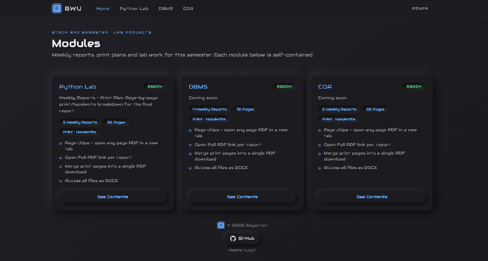
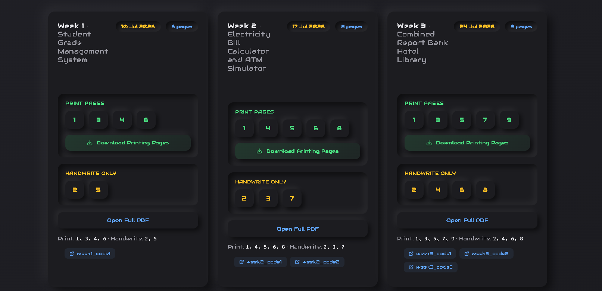
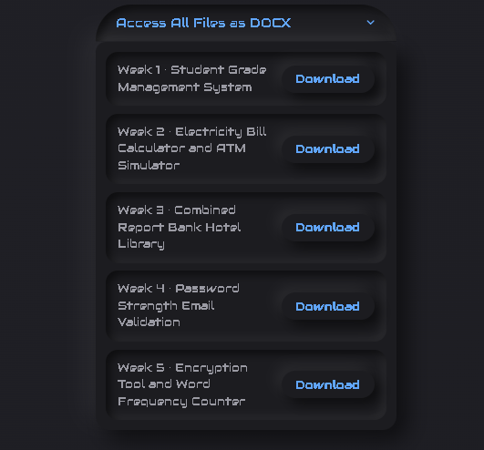

# BWU · 3rd Semester Lab Reports

A Next.js app for managing BTech 3rd semester lab reports. Public module pages with neumorphic dark UI, admin dashboard for uploading weekly PDFs, auto-splitting into print/handwrite pages, and direct Cloudinary storage.



---

## Features

### Public Pages



- **Module listing** — neumorphic cards showing weekly reports, page counts, and feature lists
- **Week cards** — per-week print/handwrite page chips (click to open PDF in new tab)
- **Download Printing Pages** — server-side merge of all print pages into a single PDF
- **Open Full PDF** — proxied download with correct filename
- **Week links** — external links (GitHub, docs, etc.) shown as chips on each card

### DOCX Access



- Dropdown menu to download any week's DOCX file directly

### Admin Dashboard

- **Upload & Auto-Split** — upload a weekly PDF, auto-parse filename, split into individual page PDFs
- **Direct Cloudinary upload** — files upload browser-to-Cloudinary (bypasses Next.js body limits)
- **Re-split Pages** — idempotent re-split with no duplicates
- **DOCX upload/replace** — per-week DOCX management
- **Week links** — add external links per week (GitHub, etc.)
- **Title editing** — inline edit per week
- **Date picker** — custom neumorphic calendar
- **Delete week** — full Cloudinary + DB cleanup
- **Module meta editor** — tagline, stats, features per module
- **Toast notifications** — success/error feedback on every action
- **Loading spinners** — on all buttons during processing

---

## Stack

| Layer | Tech |
|-------|------|
| Framework | Next.js 16.3.0 (App Router, Turbopack) |
| UI | React 19.2.8, TypeScript 5 |
| Backend | Supabase (PostgreSQL + RPC) |
| Storage | Cloudinary (PDF + DOCX) |
| Auth | jose JWT, PIN-based admin login |
| PDF | pdf-lib 1.17.1 (split + merge) |
| Styling | Neumorphic dark UI, pure CSS |
| Logo | Generated via Pillow (`scripts/make-logo.py`) |

---

## Setup

1. Run the SQL in `supabase.md` (Supabase SQL editor) — tables, RLS, `check_admin` RPC, seeds.
2. Copy `.env.example` → `.env.local` and fill:
   - `NEXT_PUBLIC_SUPABASE_URL` / `NEXT_PUBLIC_SUPABASE_ANON_KEY` / `SUPABASE_SERVICE_ROLE_KEY`
   - `CLOUDINARY_CLOUD_NAME` / `CLOUDINARY_API_KEY` / `CLOUDINARY_API_SECRET`
   - `ADMIN_SESSION_SECRET`
3. `npm run dev` → http://localhost:3000

---

## Using the Dashboard

Login at `/admin` (link in the navbar — "Admin") with the admin seeded in `supabase.md`.

**Uploading a week** (per module):
- Filename must follow the format: `Week5_(print 1,3,5,7 pages)_Your_Title.pdf`
- Numbers in brackets are the pages to print. If nothing is printed: `Week5_(print no pages)_Your_Title.pdf`
- "Upload & Auto-Split" uploads the PDF directly to Cloudinary from your browser, then the server creates the week record and splits every page into its own PDF (print/handwrite) automatically.
- **Cloudinary free plan limit:** raw file uploads are capped at 10MB per file.

**Adding links:**
- Click "Add Link" on any week card in the admin dashboard.
- Enter a title and URL (e.g. "GitHub Repo" → `https://github.com/...`).
- Links show as clickable chips on the public card with `target="_blank"`.

---

## API Routes

| Route | Method | Auth | Description |
|-------|--------|------|-------------|
| `/api/weeks/[id]/print-merge` | GET | public | Merge print pages into single PDF |
| `/api/weeks/[id]/docx` | GET | public | Proxy DOCX download with correct filename |
| `/api/weeks/[id]/full-pdf` | GET | public | Proxy full PDF download with correct filename |
| `/api/admin/cloudinary-sign` | POST | admin | Signed upload params for direct Cloudinary upload |
| `/api/admin/upload-week` | POST | admin | Create week + split pages after direct upload |
| `/api/admin/upload-docx/[id]` | POST | admin | Save DOCX metadata after direct upload |

---

## Migration

If you already ran the original SQL, run this once to add the `links` column:

```sql
ALTER TABLE public.weeks ADD COLUMN IF NOT EXISTS links jsonb NOT NULL DEFAULT '[]'::jsonb;
```

See `supabase.md` for the full schema.

---

## Cloudinary

- **Cloud:** dhw3ttwaz
- **Folder:** `bwu/{moduleId}/Week{N}/`
- **Assets:** full PDF, page splits (print-XX, handwrite-XX), DOCX
- **Note:** Free plan requires enabling PDF/ZIP delivery in Settings → Security

---

**Made by Sayantan**
